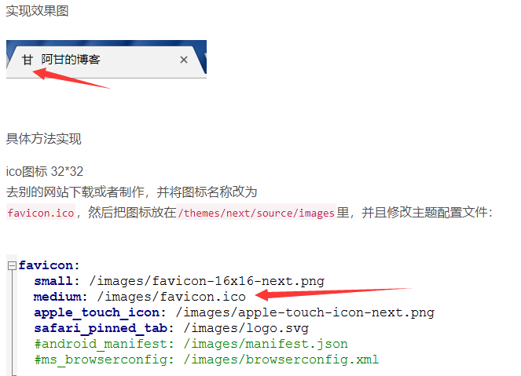

1.首先确认项目下的`_config.yml` 中有 `post_asset_folder:true`。
 Hexo 提供了一种更方便管理 Asset 的设定：`post_asset_folder`
 当您设置`post_asset_folder`为`true`参数后，在建立文件时，`Hexo`
 会自动建立一个与文章同名的文件夹，您可以把与该文章相关的所有资源都放到那个文件夹，如此一来，您便可以更方便的使用资源。

2.在hexo的目录下执行`npm install https://github.com/CodeFalling/hexo-asset-image --save`（需要等待一段时间）。

3.完成安装后用`hexo`新建文章的时候会发现`_posts`目录下面会多出一个和文章名字一样的文件夹。图片就可以放在文件夹下面。结构如下：

```
本地图片测试
├── apppicker.jpg
├── logo.jpg
└── rules.jpg
本地图片测试.md
```


<!-- more --> 

这样的目录结构（目录名和文章名一致），只要使用 `` 就可以插入图片。其中`[]`里面不写文字则没有图片标题。
 生成的结构为

```
public/2016/3/9/本地图片测试
├── apppicker.jpg
├── index.html
├── logo.jpg
└── rules.jpg
```

同时，生成的 html 是

``

而不是愚蠢的

``

注意:
 通过常规的 `markdown` 语法和相对路径来引用图片和其它资源可能会导致它们在存档页或者主页上显示不正确。在`Hexo2`时代，社区创建了很多插件来解决这个问题。但是，随着`Hexo3`的发布，许多新的标签插件被加入到了核心代码中。这使得你可以更简单地在文章中引用你的资源。


比如说：当你打开文章资源文件夹功能后，你把一个 `example.jpg`图片放在了你的资源文件夹中，如果通过使用相对路径的常规 markdown 语法 `[](/example.jpg)`，它将 不会 出现在首页上。（但是它会在文章中按你期待的方式工作）

正确的引用图片方式是使用下列的标签插件而不是`markdown`

  




参考：

1、https://www.jianshu.com/p/c2ba9533088a

2、https://blog.csdn.net/sugar_rainbow/article/details/57415705

3、https://blog.csdn.net/ganzhilin520/article/details/79048034